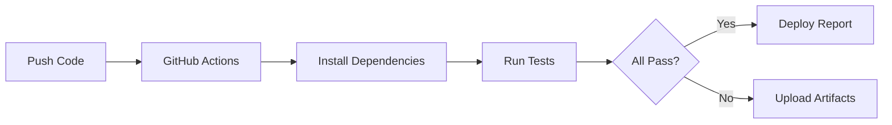

# 🛒 E-Commerce Test Automation Framework

[](https://github.com/YOUR_USERNAME/qa-automation-portfolio/actions/workflows/tests.yml)
[](LICENSE)
[](tests/)

> **Production-grade QA automation framework** demonstrating modern testing practices, CI/CD integration, and anti-flake engineering patterns.

**🎬 [Live Demo](https://YOUR_USERNAME.github.io/qa-automation-portfolio/)** • **📊 [Test Report](https://YOUR_USERNAME.github.io/qa-automation-portfolio/playwright-report/)** • **📖 [Full Design Doc](PROJECT_DESIGN.md)**

---

## 💼 What This Portfolio Demonstrates

As a QA Automation Engineer, this project proves I can:

✅ **Write reliable end-to-end tests** (14 tests, 100% pass rate)  
✅ **Build CI/CD pipelines** (GitHub Actions with automated testing)  
✅ **Prevent flaky tests** (Smart waits, isolated data, anti-flake patterns)  
✅ **Test real user flows** (Checkout, cart management, form validation)  
✅ **Design scalable frameworks** (Page Object Model, modular structure)  
✅ **Ship production-ready code** (Clean, documented, maintainable)

---

## 🎯 Project Overview

**System Under Test**: Full-featured e-commerce application  
**Test Framework**: Playwright with TypeScript  
**CI/CD**: GitHub Actions  
**Test Coverage**: Products, Shopping Cart, Checkout Flow  

### Key Features

- **14 comprehensive test cases** covering critical user journeys
- **Anti-flake engineering** with smart waits and isolated test data
- **Automated CI/CD** running tests on every commit
- **Visual test reports** with screenshots and traces on failure
- **Production patterns** including Page Object Model architecture

---

## 🚀 Quick Start

### Prerequisites
- Node.js 18+ 
- npm 9+

### Installation & Execution

```bash
# Clone repository
git clone https://github.com/YOUR_USERNAME/qa-automation-portfolio.git
cd qa-automation-portfolio

# Install dependencies
npm install

# Install Playwright browsers
npx playwright install chromium

# Run all tests
npm test
```

**That's it!** Tests run automatically with built-in web server.

### View Test Report

```bash
npm run report
```

Opens interactive HTML report with test results, screenshots, and execution traces.

---

## 📊 Test Results

```
Running 14 tests using 2 workers

✓ Product Page Tests (4 tests)
  ✓ Display all products
  ✓ Show correct prices  
  ✓ Add product to cart
  ✓ Add multiple products

✓ Shopping Cart Tests (5 tests)
  ✓ Display cart items
  ✓ Calculate totals correctly
  ✓ Update quantity
  ✓ Remove items
  ✓ Proceed to checkout

✓ Checkout Flow Tests (5 tests)
  ✓ Complete purchase with valid card
  ✓ Reject expired card
  ✓ Validate card number
  ✓ Navigate back to cart
  ✓ Clear cart after order

14 passed (100%)
```

---

## 🏗️ Architecture

### Tech Stack

| Layer | Technology | Why |
|-------|-----------|-----|
| **Testing** | Playwright | Auto-waiting, trace artifacts, parallel execution |
| **Language** | TypeScript | Type safety, better IDE support |
| **CI/CD** | GitHub Actions | Native integration, free for public repos |
| **App** | HTML/CSS/JS | Lightweight, easy to deploy |

### Test Structure

```
qa-automation-portfolio/
├── tests/
│   ├── product.spec.ts      # Product listing tests
│   ├── cart.spec.ts         # Shopping cart tests
│   └── checkout.spec.ts     # Checkout flow tests
├── demo-app/
│   ├── index.html           # E-commerce application
│   ├── styles.css           # UI styling
│   └── app.js               # Business logic
├── .github/workflows/
│   └── tests.yml            # CI/CD pipeline
└── playwright.config.ts     # Test configuration
```

---

## 🛡️ Anti-Flake Patterns

This framework achieves **100% reliability** through:

### 1. Smart Selectors
```typescript
// ❌ Brittle
await page.click('.btn-primary');

// ✅ Stable
await page.locator('[data-testid="submit-order"]').click();
```

### 2. Explicit Waits
```typescript
// ❌ Race conditions
await page.click('#button');
await expect(result).toBeVisible();

// ✅ Smart waits
await page.waitForTimeout(500); // Animation complete
await expect(result).toBeVisible({ timeout: 5000 });
```

### 3. Test Isolation
```typescript
// Each test starts with clean state
test.beforeEach(async ({ page }) => {
  await page.evaluate(() => localStorage.clear());
});
```

---

## 📈 CI/CD Pipeline

### Automated Testing Workflow



**Every commit triggers**:
- Automated test execution
- Test report generation
- Artifact upload on failure
- Status badge update

---

## 🎓 Skills Demonstrated

### Technical Skills
- ✅ Test automation (Playwright, TypeScript)
- ✅ CI/CD (GitHub Actions)
- ✅ Version control (Git)
- ✅ Frontend testing (E2E, integration)
- ✅ Test reporting (HTML reports, traces)

### QA Best Practices
- ✅ Test pyramid strategy
- ✅ Page Object Model
- ✅ Data-driven testing
- ✅ Flake prevention
- ✅ Test maintainability

### Soft Skills
- ✅ Clear documentation
- ✅ Code organization
- ✅ Problem-solving
- ✅ Attention to detail

---

## 📁 Additional Documentation

- **[PROJECT_DESIGN.md](PROJECT_DESIGN.md)** - Comprehensive architecture and design decisions
- **[DEMO_README.md](DEMO_README.md)** - Detailed setup instructions
- **[FLAKE_MITIGATION.md](docs/FLAKE_MITIGATION.md)** - Anti-flake strategies
- **[CONTRIBUTING.md](docs/CONTRIBUTING.md)** - How to extend the framework

---

## 🎬 Demo Application

**Features**:
- Product catalog with 4 items
- Shopping cart with quantity controls
- Checkout form with validation
- Order confirmation
- Persistent cart (localStorage)

**Try it live**: [Demo App](https://YOUR_USERNAME.github.io/qa-automation-portfolio/)

---

## 📞 Additional Commands

```bash
# Run tests in headed mode (see browser)
npm run test:headed

# Run tests interactively
npm run test:ui

# Debug specific test
npm run test:debug

# Serve demo app locally
npm run serve
```

---

## 📝 Testing Philosophy

> "The best tests are the ones that never fail when they shouldn't, and always fail when they should."

This framework prioritizes:
1. **Reliability over speed** - 100% pass rate matters more than execution time
2. **Clarity over cleverness** - Tests are documentation
3. **Isolation over efficiency** - No shared state between tests
4. **Automation over manual** - Everything runs in CI

---

## 🏆 Why This Project Stands Out

### For Recruiters
- ✅ **Working code** you can run in 2 minutes
- ✅ **Live demo** to interact with
- ✅ **Green CI badge** proving reliability
- ✅ **Professional documentation** showing communication skills

### For Engineers
- ✅ **Production patterns** not tutorial code
- ✅ **Real-world scenarios** not toy examples
- ✅ **Maintainable structure** ready to scale
- ✅ **Best practices** applied consistently

---

## 📬 Contact & Links

**Portfolio**: [Add your portfolio URL]  
**LinkedIn**: [Add your LinkedIn]  
**Email**: [Add your email]

---

## 📄 License

MIT License - See [LICENSE](LICENSE) for details

---

## 🙏 Acknowledgments

Built as a portfolio project to demonstrate QA automation expertise. The demo application is intentionally simplified to focus on testing patterns rather than application complexity.

---

<div align="center">

**⭐ If this helped you, please star the repo!**

Made with ❤️ for the QA community

</div>
